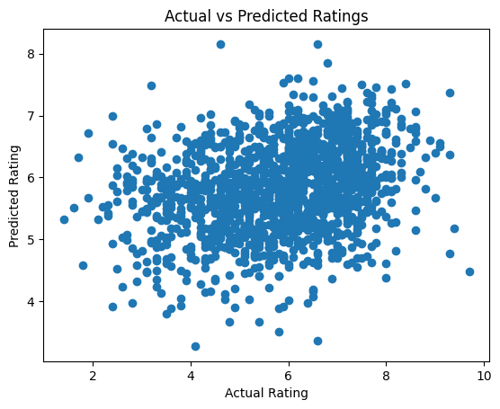

# 🎬 Movie Rating Prediction

## 📌 About the Project
I worked on this project to explore how machine learning can be used to predict movie ratings based on features like genre, director, and actors.

The goal was to build a model that can estimate the rating of a movie using historical data.

---

## 📊 Dataset
The dataset includes information about movies such as:
- Genre  
- Director  
- Actors  
- Rating (target variable)  

While working with the data, I noticed that it contained missing values and some inconsistencies, so preprocessing was required.

---

## ⚠️ Challenges Faced
- Missing values and noisy data  
- Some rows had incorrect or inconsistent formatting  
- Categorical features needed to be converted into numerical form  

---

## 🔄 What I Did

### 🧹 Data Cleaning
- Selected relevant columns  
- Removed rows with missing values  
- Converted rating column to numeric format  
- Skipped invalid rows while loading the dataset  

---

### 🔤 Feature Encoding
- Converted categorical features (Genre, Director, Actor) into numerical values using **Label Encoding**

---

### 🤖 Model Building
I trained two models:
- **Linear Regression**  
- **Random Forest Regressor**  

Random Forest performed better as it was able to capture more complex relationships in the data.

---

## 📈 Model Evaluation
The models were evaluated using:

- **Mean Squared Error (MSE)** → Measures prediction error  
- **R² Score** → Indicates how well the model fits the data  

---

## 📊 Visualization

### Actual vs Predicted Ratings

This plot shows how close the predicted ratings are to the actual ratings.  
Points closer to a diagonal trend indicate better predictions.

---

## 🧠 Key Learnings
- Real-world datasets are often messy and require proper cleaning  
- Categorical data must be encoded before training models  
- Regression models are used for predicting continuous values  
- Random Forest can outperform simpler models in many cases  

---

## 🛠️ Tools Used
- Python  
- Pandas  
- Scikit-learn  
- Matplotlib  

---

## 🚀 Final Thoughts
This project helped me understand the complete workflow of a regression-based machine learning problem — from data preprocessing to model evaluation and visualization.

---

## 📂 Dataset
The dataset is not included in this repository due to its size.

👉 https://www.kaggle.com/datasets/adrianmcmahon/imdb-india-movies  

After downloading:
- Place the CSV file in the project folder  
- Run the notebook  

---

## 👤 Author
Siddhi  

Open to feedback and suggestions 🙂
